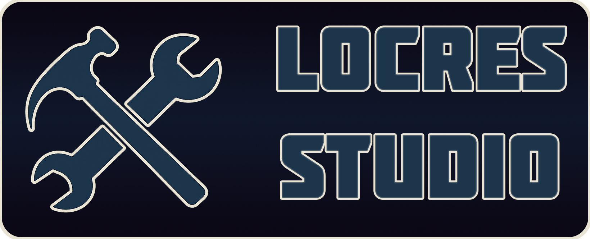
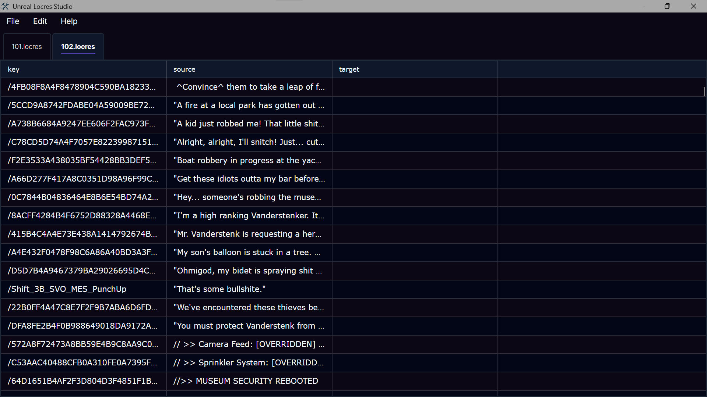
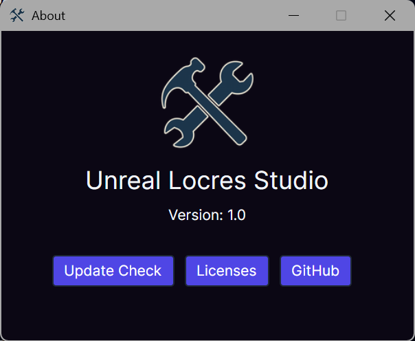
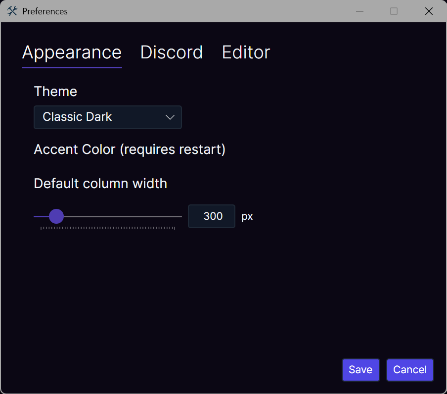
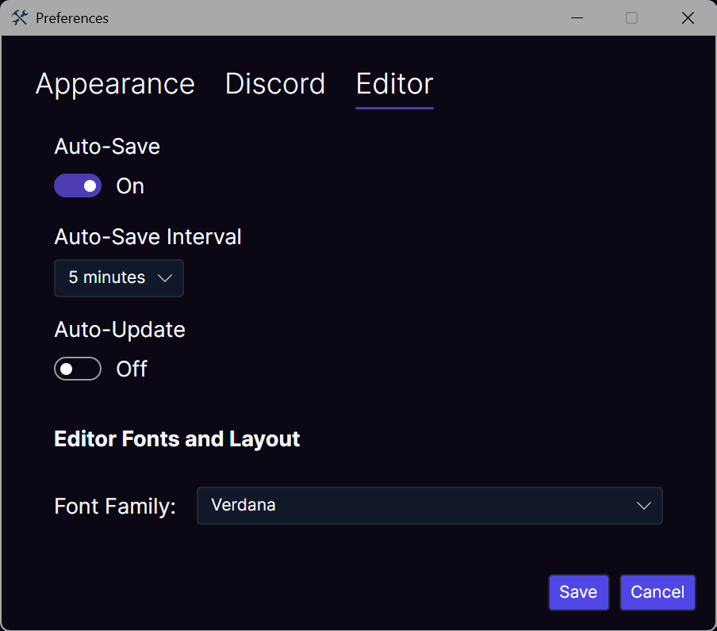
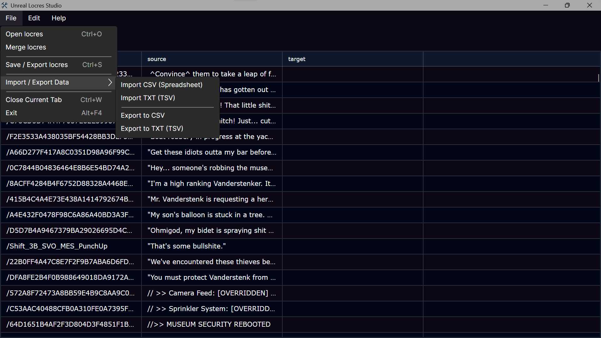

# LocresStudio 🤖



**The modern, tabbed editor for Unreal Engine localization files.**

LocresStudio is a specialized GUI tool for editing Unreal Engine `.locres` files. It is a "Power User" fork of [UnrealLocresEditor](https://github.com/snoozeds/UnrealLocresEditor), enhanced with multi-file support, Excel compatibility, and advanced accessibility features for translators.

## 🚀 Key Features

### 🎨 Customization & Accessibility (New!)

* **🌍 RTL Support:** Native support for **Right-to-Left** languages (Arabic, Hebrew, Farsi). Toggling RTL instantly flips the grid layout and text alignment.
* **🔤 Font Control:** Pick any installed system font (e.g., Arial, Noto Sans) and adjust the font size to ensure non-Latin scripts are readable.
* **🌗 Dynamic Themes:** Switch instantly between **Classic Dark**, **Soft Light**, **Cool Gray**, and **Purple** themes without restarting the app.

### ⚡ Workflow Enhancements

* **🖱️ Enhanced Context Menu:** Right-click any row to quickly **Copy Source to Target**, **Find/Replace**, or **🌐 Open in Google Translate** for instant lookups.
* **📝 Live Status Bar:** Track your progress with a real-time row counter (`Row: 15 / 1000`) and unsaved changes indicator at the bottom of the window.
* **📂 Multi-Tab Interface:** Open, edit, and switch between multiple localization files simultaneously.
* **📊 Excel Compatibility:** Import/Export **TSV** and **CSV** files with smart Copy/Paste support for Excel/Google Sheets.
* **💾 Safe Editing:** Uses a sandboxed temp-file system to prevent crashes or file-locking issues.
* **🎮 Discord Rich Presence:** Shows which file you are currently editing and your line count directly on your Discord profile.

### 🛠️ Technical Improvements

* **🚀 Lightweight:** Optimized release build (~15MB download / ~40MB installed).
* **🔄 Legacy Support:** Full support for importing text files from [UE4LocalizationTool](https://github.com/amrshaheen61/UE4LocalizationsTool) (supports the `[~NAMES-INCLUDED~]` format).
* **🐧 Linux Ready:** Improved architecture ensures better compatibility with Wine environments.

## Previews

| | | |
|:-------------------------:|:-------------------------:|:-------------------------:|
|  |  ||
|  |  | |

## 📥 Installation

### Windows (x64)

LocresStudio is **fully portable**. You do not need to install .NET.

1. Go to the **[Releases Page](../../releases)**.
2. Download the **zip** file (e.g., `LocresStudio-v1.0-win-x64.zip`).
3. Extract the folder anywhere.
4. Run **`LocresStudio.exe`**.

> **Note:** Exported files are saved in the same folder inside the application directory.

---

### Linux (x64)

LocresStudio runs natively on Linux (UI), but the backend tool (`UnrealLocres`) requires Wine.

#### Prerequisites

* **Wine** must be installed (e.g., `sudo apt-get install wine wine32`).

#### Instructions

1. Download the **linux-x64.zip** from Releases.
2. Extract the files.
3. Download the original **[UnrealLocres CLI tool](https://github.com/akintos/UnrealLocres/releases/latest)** (It is an `.exe`, but we will run it with Wine).
4. Place `UnrealLocres.exe` inside your extracted folder (next to `LocresStudio`).
5. Open a terminal in that folder and run:

    ```bash
    ./LocresStudio
    ```

6. **First Time Setup:**
    * In the app, go to **Linux -> Attempt wine prefix**.
    * Follow the on-screen instructions.

---

## ❤️ Credits & Acknowledgements

LocresStudio is a fork of **UnrealLocresEditor**. While this version has evolved with new architecture and features, the foundation was built by **Snoozeds**.

If you appreciate the original work that made this tool possible, please consider supporting the original creator:

* [☕ Buy Snoozeds a Coffee (Ko-fi)](https://ko-fi.com/snoozeds)
* [❤️ Support on Patreon](https://www.patreon.com/snoozeds)
* [Original Repository](https://github.com/snoozeds/UnrealLocresEditor)

---

## Known Issues / Limitations

* The only way to add new row is to export the file to csv - create new row with the key you want and save that - then import it with Locres Studio.
* Google Translate - If multiple rows are selected it translates only that row - I might add GoogleTranslateFreeAPI - which has option for multiple, but this is as for now

*Powered by [UnrealLocres](https://github.com/akintos/UnrealLocres) and [AvaloniaUI](https://avaloniaui.net/).*

*Forked and maintained by [AcTePuKc](https://github.com/AcTePuKc).*
